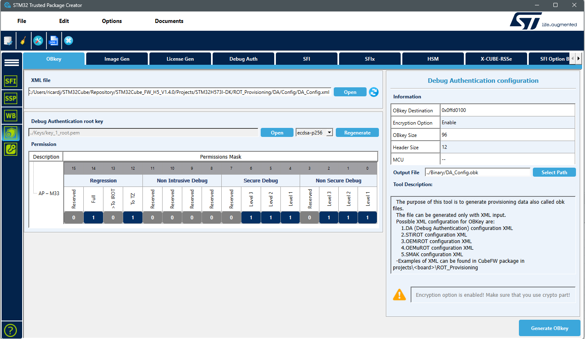
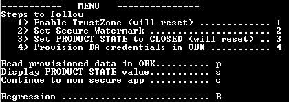

# STM32H573 provisioning Debug Authentication inside firmware when TrustZone is enabled

## Introduction
The STM32H5 series introduced a new mechanism for flash protection from JTAG access. This mechanism replaces the RDP used on most other STM32 devices.
In practice, RDP is replaced by PRODUCT_STATE.

It is possible to change the  PRODUCT_STATE to increase the protection.
The removal of the protection, similar as RDP regression, now requires the usage of an authentication mechanism.

This is called Debug Authentication or DA.
The DA purpose is to provide a robust authentication mechanism, giving ability, only to authrised people, to regress or re-open the device.

DA requires provisioning credentials in the device in the OBK storage.

This provioning involves updating programmer's protocol. This protocol is implemented in STM32CubeProgrammer and many programmers third party.
Basic sequence to follow during production is:
1) Flash firmware
2) Change product state to PROVISIONING
3) Provision credentials using specific protocol
4) Change product state to CLOSED

When it comes to device production and firmware download to flash, you may face 2 issues:
* The programer used by your manufacturer does not support this provisioning protocol
* Providing credential file together with firmware file is something you want to avoid.

In order to address this cases, we provide here necessary information to allow you to perform all required actions from the firmware itself upon first boot.

## Debug authentication principles for H573 (HW crypto enabled) with TrustZone enabled products

First you can read the [AN6008](https://www.st.com/resource/en/application_note/an6008-getting-started-with-debug-authentication-da-for-stm32h5-mcus-stmicroelectronics.pdf) Getting started with debug authentication (DA) for STM32 MCUs to understand this mechanism.

When using HW Crypto enabled H5, the DA credentials are encrypted inside the device using the Derived Hardware Unique Key (DHUK) and the Secure HW AES accelerator.
The DHUK is not available in OPEN state. This means you must perform this encryption at least in PROVISIONING state. In our case, it will occur in CLOSED state.

Here we address the TrustZone enabled case.
If you don't enable TrustZone the provisioning of credentials will not work because of limitation related to the chip.

In our configuration (STM32H573 + TZ) you need to provision informations that will allow later to reopen the device:
1) the hash of a root public key (ECC P256) used to authenticate the user
2) a soc mask used to limit the DA capability (regression, debug reopening at specific level)

These credentials will be the same on all the devices of the same family.
They are stored encrypted in the OBK secure storage of the STM32H573.
The usual way to provide them is the provisioning process providing an obk file.
The TrustedPackageCreator allows generating such obk file using GUI and a xml configuration like this:

The format of this obk file is public and quite simple:

    1) Header
        a. Destination address in secure storage  (4 bytes)
        b. Size of payload : 0x60 (4 bytes)
        c. Encryption flag set to 1 : mandatory on STM32H573 (4 bytes)
    2) Payload
        a. Hash of remaining data (0x20 bytes)
        b. Hash of the public key (0x20 bytes)
        c. Soc Mask (0x20 bytes)

Only the payload is stored in the secure OBK storage. The first hash ensures integrity of following 0x40 bytes.

The example reuses the default DA_Config.obk provided in the STM32CubeH5.

A simple python script (ConvertBinToH.py) converts this binary file into a C header file.
This header is included in the firmware to provision these data in the OBK

## What do you get with this example ?

The example provided contains a STM32CubeIDE project that implements the necessary steps to perform the DA credential provisioning.

It provides secure and non secure applications built using STM32CubeMX.
Firmware is supposed to be used with STM32H573I-DK board.

As the purpose of this example is to show how to provision DA in production, we suppose that firmware (both secure and non secure) is flashed on a virgin device, without TrustZone enabled.

It proposes a user interface through the Virtual COM Port accessible with a terminal like TeraTerm
You can first explore the different provisioning steps.
Then you can uncomment the line containing #define AUTO in the main.c file of the secure application to launch all 4 main steps needed.

For demo purpose the menu also contains an option to regress the device wihtout going though the DA mechanism.

## What firmware is actually doing ? 

The secure application provides a menu that should be used in sequence

* "Enable TrustZone" : Check if TrustZone is enabled. If not already enabled then write TZEN option byte and reset. This must be done first if TrustZone is not alreadu enabled
* "Set Secure Watermark" : Set watermark correctly if necessary. After enabling TrustZone the secure watermark must be set to provide an area accessible to non secure firmware
* Set PRODUCT_STATE to CLOSED: Check PRODUCT_STATE option byte. If device is not in CLOSED state.
    * First check if BOOT_UBE is set to 0xB4 to boot in flash. IF not, don't change product state (if product state is changed wich BOOT_UBE set to 0xC3, chip will be bricked because STiRoT data are not provisioned)
    * Switch to iROTProvisioned (it is actually not possible to go directly in closed state)
    * Switch to Closed
    * Reset
* Provision DA credention in OBK: Check presence of DA credentials in OBK secure storage. If DA credential are not already present
    * Check the credential buffer integrity using hash. Should be OK
    * Encrypt and write the credentials in OBK

Once each 4 steps have been executed, the device has been provisioned with DA credentials.
The order of the 4 steps is important. For instance, if you invert 3 and 4, the provisioned DA credentials will not be encrypted with the right key.

After performing first 4 steps, you can check provisioning data using Read provisioned data in OBK and check PRODUCT_STATE value.

Also, an option to continue to non secure app is provided to check that configuration allows running non secure application.

## Typical sequence

1) Import project in STM32CubeIDE
2) Build Secure and non secure applications
3) Download both applications on target
4) Launch menu 1 and 2 : Option bytes are setup
5) Read the provisioned data using "p" : should read "FF"
6) launch menu 3 to close the device. Can be checked using "s"
7) launch menu 4 to provision the DA credentials. Check using "p"

From this stage, the device is closed and provisioned.
You can check provisionning integrity by launching discovery.bat located in Tools directory. You should see following line in the trace

`discovery: ST provisioning integrity status:0xeaeaeaea`

Then you can launch regression.bat to regress the device to open state.
This regression can also be launched using menu

